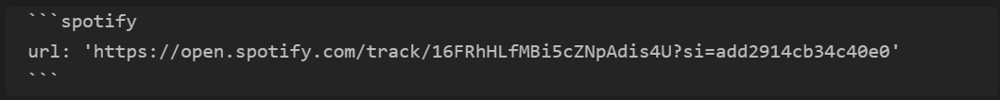

# Obsidian Spotify Embed

> **Warning:** This plugin is in development and should be
> considered unstable! Always make a backup of your vault before testing out a new plugin.

**Warning: This plugin renders embed HTML provided by the Spotify API
(https://open.spotify.com). Only use it if you trust that spotify.com has not
been compromised.**

Embed songs, albums and playlists from Spotify in your Obsidian notes.

Example use:

turns into:

